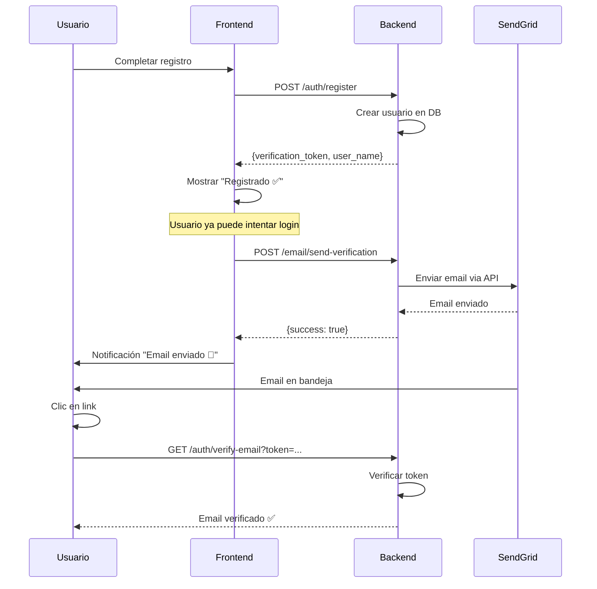

# ✅ Resumen: Email desde Frontend con Proxy Seguro

## 🎯 Cambios Realizados

### Backend
1. ✅ **Comentado envío de email** en `auth.py` (registro)
2. ✅ **Creado endpoint proxy** `/email/send-verification` en `email_proxy.py`
3. ✅ **Backend retorna datos** necesarios para el frontend: `verification_token` y `user_name`
4. ✅ **Credenciales seguras**: SendGrid API Key sigue en variables de entorno

### Frontend
1. ✅ **Creado servicio de email** `email-service.js` para llamar al proxy
2. ✅ **Actualizado auth.js** para enviar email post-registro
3. ✅ **Mejorado feedback visual** en `main.js` con notificaciones de estado
4. ✅ **Sin exposición de credenciales**: Todo a través del proxy

---

## 🧪 Cómo Probar

### Opción 1: Página de Test (Recomendado)
```bash
# 1. Abrir el archivo de test en el navegador
start frontend/test-email-frontend.html

# 2. Ingresar un email válido (que puedas revisar)
# 3. Hacer clic en "Probar Registro + Email"
# 4. Verificar:
#    ✅ Mensaje de éxito en la página
#    ✅ Email recibido en tu bandeja
#    ✅ Logs en consola del navegador (F12)
```

### Opción 2: Usar la Aplicación Real
```bash
# 1. Ir a tu frontend desplegado
# 2. Hacer clic en "Registrarse"
# 3. Llenar el formulario
# 4. Verificar notificación de email enviado
# 5. Revisar tu bandeja de entrada
```

### Opción 3: Test del Proxy con PowerShell
```powershell
# 1. Editar test_email_proxy.ps1 y cambiar el email
# 2. Ejecutar:
cd backend
.\test_email_proxy.ps1
```

---

## 🔍 Verificar Deployment

### Verificar que el código se desplegó:
```bash
# Ver commit más reciente
git log --oneline -1

# Debe mostrar:
# 9e0e96c feat: Migrar envío de email a frontend con proxy seguro
```

### Verificar endpoint proxy en Render:
```bash
# Debería responder con error 422 (falta body)
curl https://vexuspage.onrender.com/api/v1/email/send-verification
```

---

## 📋 Checklist de Configuración

### Backend (Render)
- [ ] Variable `SENDGRID_API_KEY` configurada
- [ ] Variable `EMAIL_FROM` configurada (debe estar verificado en SendGrid)
- [ ] Código desplegado (commit 9e0e96c)
- [ ] Endpoint `/api/v1/email/send-verification` accesible

### SendGrid
- [ ] Sender verificado (`EMAIL_FROM`)
- [ ] API Key activa
- [ ] Free tier activo (100 emails/día)

### Frontend
- [ ] Código actualizado con `email-service.js`
- [ ] `auth.js` importa y usa el servicio de email
- [ ] Configuración de API en `config.js` apunta a Render

---

## 🔐 Seguridad

### ✅ Credenciales Protegidas
```
Frontend (Navegador)          Backend (Render)          SendGrid
─────────────────────         ─────────────────         ────────
email, nombre, token    →     [Proxy Endpoint]    →    [API Request]
                              ↓
                         SENDGRID_API_KEY
                         (Oculta del frontend)
```

**Nunca se expone en el navegador:**
- ❌ SENDGRID_API_KEY
- ❌ EMAIL_FROM (está en frontend config pero no es crítico)
- ❌ Detalles de implementación de SendGrid

---

## 🐛 Troubleshooting

### Email no se envía
1. **Verificar consola del navegador**: ¿Hay errores en la llamada al proxy?
2. **Verificar logs de Render**: ¿El proxy recibe la solicitud?
3. **Verificar SendGrid**: ¿El sender está verificado?

```bash
# Ver logs de Render
# Ir a: https://dashboard.render.com → Tu servicio → Logs
```

### Error 403 Forbidden
```
❌ Sender no verificado en SendGrid
✅ Solución: Verificar EMAIL_FROM en SendGrid Dashboard
```

### Error 401 Unauthorized
```
❌ API Key inválida o no configurada
✅ Solución: Verificar SENDGRID_API_KEY en Render
```

### Email tarda mucho
```
⚠️ Es normal (5-30 segundos)
✅ El usuario ya está registrado (respuesta instantánea)
✅ Email se envía en segundo plano desde el frontend
```

---

## 📊 Flujo Completo



---

## ⏭️ Próximos Pasos

1. **Probar con email real** usando `test-email-frontend.html`
2. **Verificar sender en SendGrid** si hay error 403
3. **Monitorear logs** durante las primeras pruebas
4. **Opcional**: Agregar rate limiting al proxy
5. **Opcional**: Agregar reintentos automáticos en frontend
6. **Cleanup**: Remover endpoints de debug cuando todo funcione

---

## 📞 Comandos Útiles

```powershell
# Ver estado de Git
git status

# Ver último commit
git log --oneline -1

# Probar endpoint de registro
$body = @{name="Test"; email="test@example.com"; password="Test123!"} | ConvertTo-Json
Invoke-RestMethod -Uri "https://vexuspage.onrender.com/api/v1/auth/register" -Method Post -Body $body -ContentType "application/json"

# Abrir página de test
start frontend/test-email-frontend.html

# Ver logs de errores del frontend
# Abrir consola del navegador (F12) → Console
```

---

## 📝 Archivos Creados

- ✅ `backend/app/api/v1/endpoints/email_proxy.py` - Endpoint proxy
- ✅ `frontend/Static/js/email-service.js` - Servicio de email
- ✅ `frontend/test-email-frontend.html` - Página de pruebas
- ✅ `backend/test_email_proxy.ps1` - Script de test
- ✅ `MIGRACION_EMAIL_FRONTEND.md` - Documentación detallada
- ✅ `RESUMEN_CAMBIOS.md` - Este archivo

---

## ✨ Ventajas de Esta Solución

1. **Registro instantáneo** (<500ms) - Usuario no espera por email
2. **Credenciales seguras** - API Key nunca sale del backend
3. **Feedback claro** - Usuario sabe si el email se envió o no
4. **Fácil debugging** - Errores visibles en consola del navegador
5. **Sin bloqueo de Render** - Usa HTTP (443) en vez de SMTP (587)
6. **Escalable** - Fácil agregar más funcionalidades de email

---

**¡Listo para probar! 🚀**
